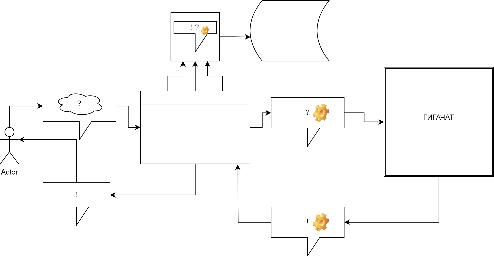

## ПРОЦЕСС 

ПОЛЬЗОВАТЕЛЬ вводит запрос  
- текст или голос
- на каком языке 

СЕРВИС:
- обрабатывает запрос: 
	- извлекает метаданные, заносит в лог
	- обогащает запрос 
	- передаёт обработанный запрос в Гигачат
	
ГИГАЧАТ
- (магия)

СЕРВИС: 
- обрабатывает ответ Гигачата:
	- извлекает метаданные, заносит в лог 
	- ? обогащает / упрощает ответ Гигачата 
	- передаёт ответ пользователю 
	
GOTO 1

## ДИАГРАММА 

## НАПРАВЛЕНИЯ 

### few-shot learning 
- обучение на малом количестве примеров: (g3p)
- можно регулярно делать выборку наиболее ярких обучающих пар (последовательностей) для few shot (мосуч) 
- яркость оценивать каким-нибудь простым базовым методом типа tf-idf (нмо) 
- также можно делать синтетическую выборку запросов, сгенерённых на основе логов (мокп) 

### fine-tuning
- несколько тысяч примеров (наверное, собралось уже за всё время) (оатр, нмо, лр) 
- можно закрутить в автоML? постоянное дообучение (амл)
- нужен надёжный мониторинг производительности дообученной модели (ксго, кд, пго)
- если ещё не

### промпт инжиниринг 
- есть ли более приличный метод, чем ручной перебор 
- промптовая обвязка (видимо, в этом направлении) (
- автоматически дорабатывает, улучшает и редрумит промпты (амл, мосуч, пго)
- под капотом небольшая простая модель или несколько (нмо) 
- вопросы производительности (сбп)

## КОММЕНТАРИИ

### архитектура
1. Микросервисы
- докеры с фронтом / бэком / базой / тестированием / аналитикой / обучением 
2. Самодостаточные (полные) компоненты
- для горизонтального расширения 
3. Можно совместить, внизу мс, вверху компоненты. 
- обновлять всех сразу 

### стэк 
Есть ли шаблонная заготовка под сервис из (условно) кафки-эйр/млфлоу-кликхауса-etc 
- если нет, то не нужно ли сначала сделать и отладить её?
- типа, сидит всё в одном образе (комплекте образов), запускается одним docker-compose 
- а затем растёт по мере разработки и допиливания в свою сторону 

Если делать с нуля (вроде нет, но вдруг), 
- то какие решения есть ранее и/или у смежников 

### визуализация / контроль эффективности 
Прикрутить красивое визуальное представление эффективности:

- если сервис работает хорошо, то визуальная картинка красивая
- если нет, то становится некрасивая или угрожающая 
- генеративная сеть (изображение + музыка) 
- дорого 

### классификация 

- (очевидное) продукты = метки. 
- Соответственно, любая нейросеть (по типу распознавания изображений с софтмаксом на выходном слое) 
может присвоить значения вероятностей этим меткам вероятности 
	- вход обогащается контекстом, т.е. туда входит весь текущий диалог + история пользователя, каждый раз обновляясь
	- нейросетка должна быть быстрой (маленькой) 
	- самообучающейся (autoML), т.е. нужен параллельный контур / конвейер 
	
### идеи из RecSys 
- сервис на стыке NLP и RecSys 
- сверхразреженные даже по меркам RecSys айтемы (описание страховых продуктов) 
- user based / product based и тогдалие 	
- ограниченное распознавание, распознавание на ограниченном участке фрейма 
- условие выхода сервиса из чата 
	
### аналитика
смотрит на соответствие ответов (предложений продуктов) запросам 
- целевые (вменённые) метрики 
- дополнительные собственные метрики 
- тестирование всех метрик (включая вменённые) 
= (метао)
	
### генератор 
- нужно декомпозировать (токенизировать) продукты (единицы, "кубики" продукта)
- регуляторные ограничения 
- способ деления на токены/кубуки -- тж фактор, со своей метрикой 
- генератор страховых продуктов:
	- MVP -- с простановкой галочек, прод -- по устному запросу + контекст + история/ПДн

### вопросики
• Используется ли Гигачат на всех / любом / ограниченном количестве этапов? 
- если на полную: то его можно использовать для перевода, извлечения метаданных и даже собственно обогащения запроса 
- то есть это всю дорогу сплошной Гигачат в разных ипостасях под разными АПИ/промптовыми обёртками 
- если нет, то какие ограничения 
	
• Можно ли валидировать Гигачат и/или обвязку внешними моделями сторонних производителей? 
- ЯндексГПТ, ОпенАИ (пиратски), открытые платформы
- валидационный (ещё один параллельный) конвейер

### литература и ссылки 
1. (g3p) GPT-3: программирование на Python в примерах
	- как к AI прикручивать сервис, общее представление 
	- промпт инжиниринг 
	- примеры 
2. (мосуч) Машинное обучение с участием человека 
	- организация аннотации данных 
	- что и сколько должен проверять человек 
3. (оатр) Осваиваем архитектуру Трансформер
	- примеры fine-tuning
	- обзор легких и эффективных трансформеров 
4. (нмо) Нейросетевые методы в обработке естественного языка 
	- разработка признаков 
	- базовые подходы 
5. (ксго) Конструирование систем глубокого обучения 
	- раздача моделей 
	- оркестровка 
6. (алпп) Алгоритмы с примерами на Python 
7. (твмс) Теория вероятностей и мат. статистика, рук-во по решению задач 
8. (пго) Прикладное глубокое обучение 
	- логрег на простых нейронках 
	- базовые нейронки 
9. (лг) Логистическая регрессия 
10. (мокп) Машинное обучение, конструирование признаков 
	- tf-idf, pca, стекирование 
11. (иссп) Изучение сложных систем с помощью Python 
12. (метао) Метаобучение. Применение в АвтоМЛ и науке о данных 
	- оценка метаобученяи и АвтоМЛ
	- генерация признаков 
	- метапризнаки 
	- рекомендация алгоритма для потоковых данных 
13. (амл) Введение в автоматизированное машинное обучение 
	- конвейер произвольного размера 
14. (сбп) Сверхбыстрый Python 
15. ...